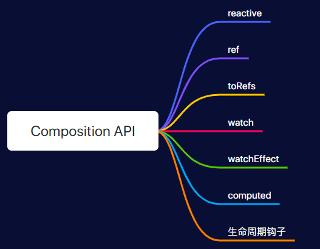
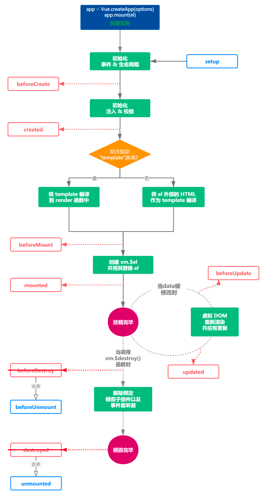
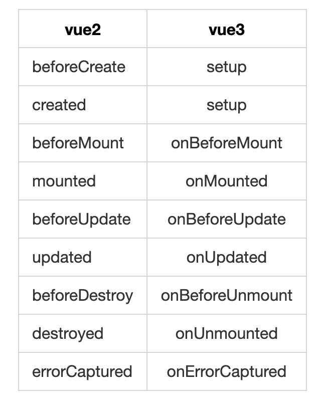

# Composition API



## setup

setup是Vue3.x新增的一个内容，所有`Composition API`的内容都要写在里面。

setup是一个组件的入口，它运行在组件被实例化后时候，props属性被定义之后，实际上等价于Vue2.x版本的`beforeCreate`和`created`这两个生命周期。

**setup函数的注意点**：

- 由于在执行 setup函数的时候，还没有执行 Created 生命周期方法，所以在 setup 函数中，无法使用 data 和 methods 的变量和方法
- 由于我们不能在 setup函数中使用 data 和 methods，所以 Vue 为了避免我们错误的使用，直接将 setup函数中的this修改成了 undefined
- setup函数只能是同步的不能是异步的

**setup 参数**

使用`setup`时，它接受两个参数：

1. props: 组件传入的属性
2. context

setup 中接受的`props`是响应式的， 当传入新的 props 时，会及时被更新。由于是响应式的， 所以**不可以使用 ES6 解构**，解构会消除它的响应式。 

## reactive、ref 与 toRefs

Vue2.x是将数据定义在data中，而Vue3.x用reactive和ref定义数据。

### reactive和ref的区别

reactive用于处理对象的数据绑定，但是不能代理基本类型的数据；

而ref既可以代理基本类型的数据，也可以代理对象的数据。

**demo**

<reactive-ref />

@[code](../.vuepress/components/reactiveRef.vue)

### toRefs

上面说了`props`是响应式的，所以不可以使用**解构**。同理，如上面的代码的stateReactive和stateRef也不能使用**解构**。那么有什么方式可以使用解构后的数据呢，那就是`toRefs`，toRefs可以将一个reactive对象转化成属性全部为ref对象的普通对象。

**没有toRefs demo**

<no-refs-demo />

@[code](../.vuepress/components/noRefsDemo.vue)

**有toRefs demo**

<to-refs-demo />

@[code](../.vuepress/components/toRefsDemo.vue)


## 生命周期

通过生命周期图来看下options API和compositio API的对比







## watch和watchEffect的用法

### watch

> watch 函数用来侦听特定的数据源，并在回调函数中执行副作用。默认情况是惰性的，也就是说仅在侦听的源数据变更时才执行回调。

```vue
watch(source, callback, [options])
复制代码
```

参数说明：

- source: 可以支持 string,Object,Function,Array; 用于指定要侦听的响应式变量
- callback: 执行的回调函数
- options：支持 deep、immediate 和 flush 选项。

**监听ref和reactive定义的数据**

<watch-ref-reactive />

@[code](../.vuepress/components/watchRefReactive.vue)

**监听多个数据**

<watch-multiple />

@[code](../.vuepress/components/watchMultiple.vue)

**Options**

和`options API`的deep和immediate一样，`deep`可以观察复杂的嵌套数据，因为watch是惰性的，`immediate`可以立即执行watch的回调函数

flush:

- 默认为 'post'
- 如果为 'sync'，则立即执行 cb
- 如果为 'pre' 或 'post'，则用 queueFlushJob 插入队列前或后在 nextTick 异步执行

 **stop停止监听**

watch的监听会在组件销毁时自动停止，那如果想要销毁前停止某个watch，可以如下方式

<stop-watch />

@[code](../.vuepress/components/stopWatch.vue)


### watchEffect

**watchEffect与watch的区别：**

watch 是需要传入侦听的数据源，而 watchEffect 是自动收集数据源作为依赖。

watch 可以访问侦听状态变化前后的值，而 watchEffect 没有，watchEffect获取的改变后的值。

watch 是属性改变的时候执行，当然也可以immediate，而 watchEffect 是默认会执行一次(相当于自带 immediate)，然后属性改变也会执行。

**demo**

<watch-effect-demo />

@[code](../.vuepress/components/watchEffectDemo.vue)


## 简单实践

那么简单学习了Composition API以后那么我们来看下如何用Vue3.x的Composition API来完成前面Vue2.x的demo

<vue3demo />

@[code](../.vuepress/components/vue3demo.vue)
