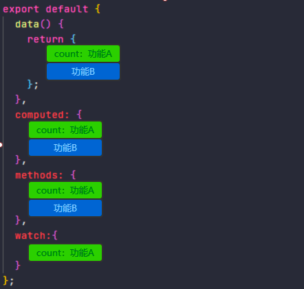
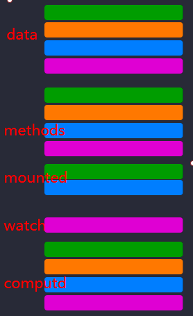
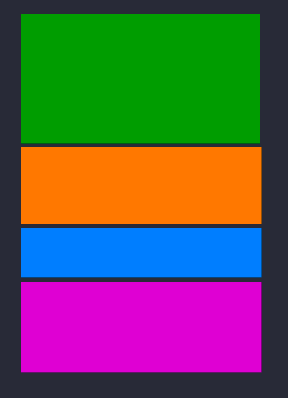

# 简单描述Vue3.x和Vue2.x的区别

首先回顾一下Vue2.x的一个代码
<vue2demo/>

@[code](../.vuepress/components/vue2demo.vue)

上面代码只是实现了对`count`的加减以及显示倍数， 就需要分别在 data、methods、computed 中进行操作，当我们增加一个需求，就会出现下图的情况：

从以上简单的2个功能看，代码还不算糟糕，但是当我们在这个组件不断增加功能需求时，比如增加搜索过滤，结果分页。我们的同一逻辑代码将在不同钩子中进行拆封，从而导致我们逻辑关注点分散，不能很好的对组件理解，降低了阅读可读性。

如果把上图的逻辑整合成下图这样，是不是代码的可读性和可维护性就会高很多。

其实在Vue2.x中也有方式来进行处理：

**混合方式Mixins**，通过Mixin可以根据逻辑关注点进行组织代码。

**混合方式Mixins的缺点：**

- 它们容易发生冲突，最终可能导致属性名称冲突。
- 不清楚混合元素如何作用
- 混合后的组件属性不方便在其他组件中重用。

所以， Vue3.x 就推出了`Composition API`主要就是为了解决上面的问题，将零散分布的逻辑组合在一起来维护，并且还可以将单独的功能逻辑拆分成单独的文件。

## 其它区别

- performance优化
- 提供了tree shaking
- 更好的ts支持
- 响应式原理的不同
- ...

