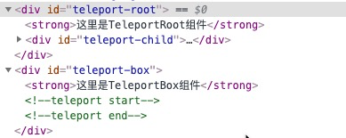

# Teleport

> Vue 鼓励我们通过将 UI 和相关行为封装到组件中来构建 UI。我们可以将它们嵌套在另一个内部，以构建一个组成应用程序 UI 的树。
>
> 然而，有时组件模板的一部分逻辑上属于该组件，而从技术角度来看，最好将模板的这一部分移动到 DOM 中 Vue app 之外的其他位置。
>
> 一个常见的场景是创建一个包含全屏模式的组件。在大多数情况下，你希望模态框的逻辑存在于组件中，但是模态框的快速定位就很难通过 CSS 来解决，或者需要更改组件组合。

## Teleport的使用

当我们有三个组件，分别是`TeleportRoot`、`TeleportBox`和`TeleportChild`组件，当我们在页面同时引入`TeleportRoot`和`TeleportBox`，然后又在`TeleportBox`中引入`TeleportChild`组件。但是又想把`TeleportChild`里的dom在`TeleportRoot`组件中渲染，这个时候就用到了teleport，如下所示

**TeleportRoot**

@[code](../.vuepress/components/TeleportRoot.vue)

**TeleportBox**

@[code](../.vuepress/components/TeleportBox.vue)

**TeleportChild**

@[code](../.vuepress/components/TeleportChild.vue)

<teleport-root />

<teleport-box />

